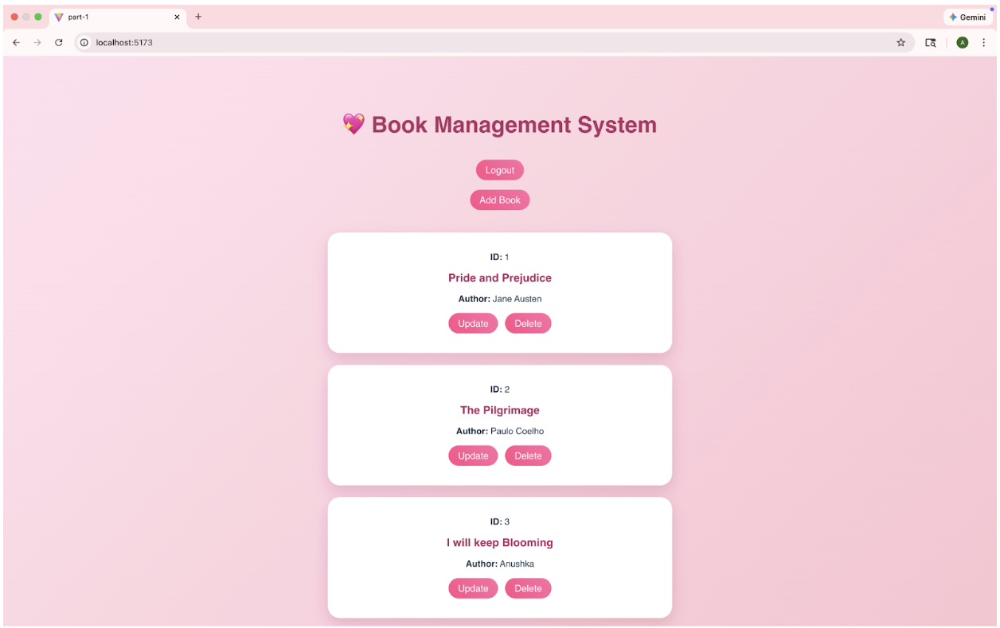
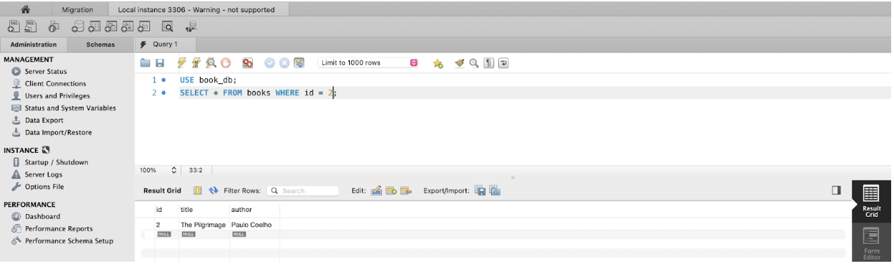
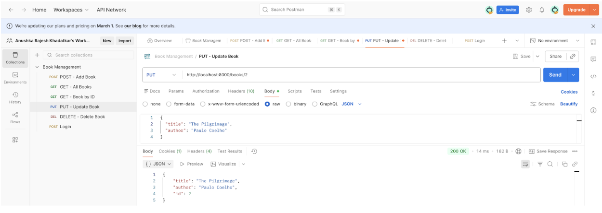

# 📚 Book Management System

A full-stack web application for managing a book collection with user authentication, built with **React + Vite** (frontend) and a **Python** backend connected to a **MySQL** database.

---

## 🚀 Tech Stack

| Layer | Technology |
|-------|-----------|
| Frontend | React, Vite, React Router DOM |
| Backend | Python |
| Database | MySQL |
| API Testing | Postman |

---

## ✨ Features

- **User Authentication** — Login with email and password
- **View Books** — Browse all books or look up a book by ID
- **Add a Book** — Create new entries in the collection
- **Update a Book** — Edit existing book details
- **Delete a Book** — Remove books with a confirmation prompt
- **Session Management** — Sessions table tracks authenticated users

---

## 🗂️ Project Structure

```
Book-Management-System/
├── backend/          # Python API server
├── frontend/         # React + Vite application
├── public/           # Static assets
├── UI.png            # UI screenshot
├── database.png      # Database schema screenshot
├── postman.png       # Postman API screenshot
├── eslint.config.js
└── README.md
```

---

## 🛠️ Getting Started

### Prerequisites

- Node.js & npm
- Python 3.x
- MySQL

### 1. Clone the Repository

```bash
git clone https://github.com/AnushkaKhadatkar/Book-Management-System.git
cd Book-Management-System
```

### 2. Set Up the Database

Open MySQL and run the following to create the required tables:

```sql
CREATE DATABASE books;
USE books;

CREATE TABLE users (
  id INT AUTO_INCREMENT PRIMARY KEY,
  email VARCHAR(255) NOT NULL UNIQUE,
  password VARCHAR(255) NOT NULL
);

CREATE TABLE books (
  id INT AUTO_INCREMENT PRIMARY KEY,
  title VARCHAR(255) NOT NULL,
  author VARCHAR(255) NOT NULL,
  year INT
);

CREATE TABLE sessions (
  id INT AUTO_INCREMENT PRIMARY KEY,
  user_id INT,
  token VARCHAR(255),
  created_at TIMESTAMP DEFAULT CURRENT_TIMESTAMP
);
```

### 3. Start the Backend

```bash
cd backend
pip install -r requirements.txt
python app.py
```

### 4. Start the Frontend

```bash
cd frontend
npm install
npm run dev
```

The app will be available at **http://localhost:5173/**

---

## 📡 API Endpoints

| Method | Endpoint | Description |
|--------|----------|-------------|
| `POST` | `/login` | Authenticate a user |
| `GET` | `/books` | Retrieve all books |
| `GET` | `/books/:id` | Retrieve a book by ID |
| `POST` | `/books` | Add a new book |
| `PUT` | `/books/:id` | Update a book |
| `DELETE` | `/books/:id` | Delete a book |

---

## 🖥️ UI Overview

- **Login Page** (`/`) — Authenticate with email and password
- **Home Page** — View all books in the collection
- **Add Book** — Form to create a new book entry
- **Update Book** — Edit an existing book's details
- **Delete Book** — Confirmation dialog before deletion



---

## ⚛️ React Implementation Notes

- Props are passed into the Create, Update, and Delete components
- `useState` and `useEffect` hooks are used for state and lifecycle management
- `React Router DOM` handles client-side routing between pages

---

## 🗄️ Database Schema

The application uses three tables: `users`, `books`, and `sessions`.



---

## 🧪 Testing with Postman

All CRUD endpoints have been tested via Postman:

- `POST /books` — Adds a new book and confirms it appears in the database and UI
- `GET /books` — Returns the full list of books
- `GET /books/:id` — Returns a single book by ID
- `PUT /books/:id` — Updates book details (e.g., title) and reflects changes in MySQL
- `DELETE /books/:id` — Removes a book from the database



---

## 👤 Author

**Anushka Khadatkar**
- GitHub: [AnushkaKhadatkar](https://github.com/AnushkaKhadatkar)
- Email: Anushkak1202@gmail.com
- LinkedIn: [Anushka Khadatkar](https://www.linkedin.com/in/anushka-khadatkar/)
- Medium: [Anushka Khadatkar] (https://medium.com/@anushkak1202)
